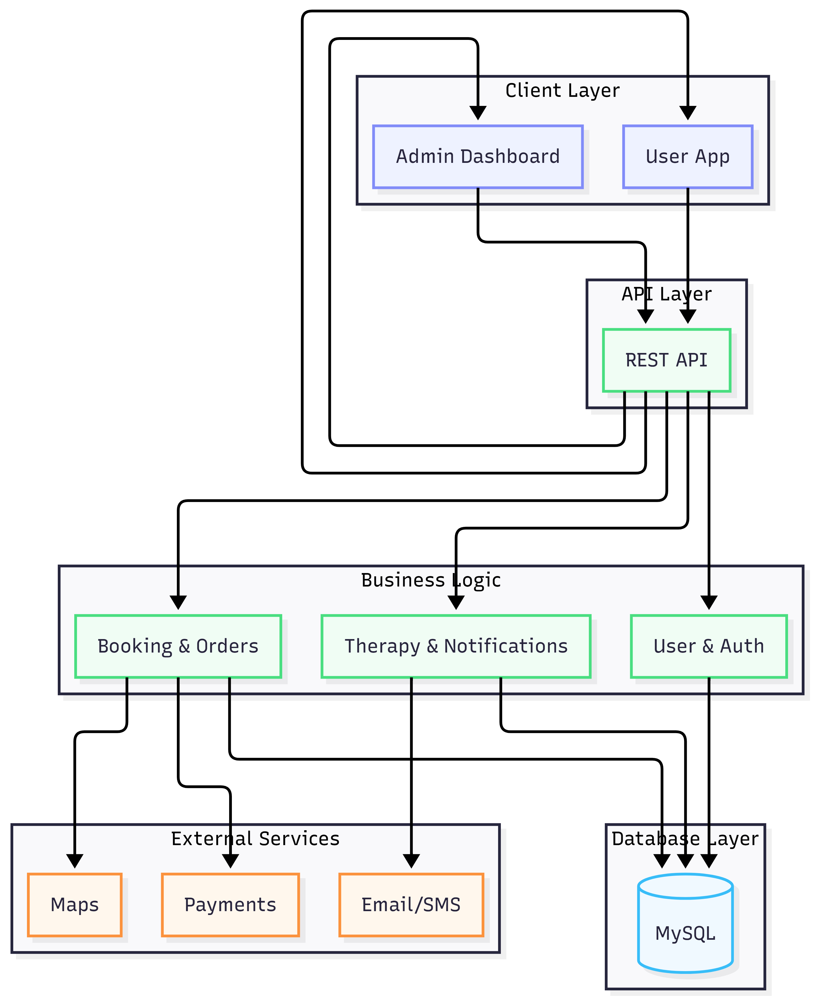

# System Design Specification: Wellness Marketplace
## Applied Software Engineering Principles for Scalability & Efficiency
### Author: Maaz Shaikh | Software Engineering | Walchand Institute of Technology

---

## 1. Introduction
This document outlines the architectural and system design for the **Wellness Marketplace for Alternative Therapies**. The design focuses on fundamental software engineering principles to ensure the system is not only functional but also **scalable, efficient, and maintainable** as the user base grows.

---

## 2. Design Principles Applied
The system design is guided by the following core principles:

1.  **Separation of Concerns (SoC)**: Dividing the application into distinct layers (Presentation, Business Logic, Data Access) to minimize dependencies.
2.  **Modularity**: Using a service-oriented approach to allow individual components (e.g., Payment, Booking, Auth) to be developed and scaled independently.
3.  **Scalability (Horizontal)**: Designing the backend to be stateless, allowing multiple instances to run behind a load balancer.
4.  **Efficiency**: Implementing caching and asynchronous processing to reduce latency and server load.
5.  **Security by Design**: Integrating JWT-based authentication and role-based access control (RBAC) at every layer.

---

## 3. High-Level System Architecture
The system follows a **Layered Micro-Kernel Architecture** (currently a modular monolith designed for future microservices transition).

### 3.1 Architectural Diagram

*Figure 1: High-level visual representation of the wellness marketplace tech stack.*

### 3.2 User Order and Therapy Flow

*Figure 2: Detailed sequence and data flow for user orders and therapy sessions.*

---

## 4. Scalability Strategies

### 4.1 Horizontal Scaling of Application Tier
The Spring Boot backend is **stateless**. Session information is not stored in memory but passed via **JWT tokens**. This allows the Load Balancer to distribute traffic across `N` number of backend instances.

### 4.2 Database Scalability: Read/Write Splitting
As the number of patients browsing practitioners increases, the database read load will spike.
-   **Primary Node**: Handles all `WRITE` operations (Registration, Booking, Updates).
-   **Read Replicas**: Multiple nodes handle `READ` operations (Searching practitioners, viewing profiles). This ensures that heavy browsing doesn't slow down the booking process.

### 4.3 Caching with Redis
To reduce database hits for static or slow-changing data:
-   **Practitioner Profiles**: Frequently viewed profiles are cached in Redis.
-   **Session Metadata**: Temporary state for the booking flow.
-   **Rate Limiting**: Preventing API abuse by tracking request counts per IP in Redis.

---

## 5. Efficiency & Performance Optimization

### 5.1 Asynchronous Processing (Message Queues)
Non-critical tasks are moved out of the main request-response cycle to ensure fast user feedback.
-   **Notifications**: Sending emails or push notifications is handled by a background worker (e.g., using Spring `@Async` or RabbitMQ).
-   **AI Recommendations**: Calculating personalized suggestions is done asynchronously so it doesn't block the UI.

### 5.2 Database Indexing
Critical columns such as `email`, `practitioner_id`, `specialization`, and `session_date` are indexed to ensure `O(log n)` search complexity instead of `O(n)`.

---

## 6. Data Design (Entity Relationship Diagram)
The database is normalized to **3rd Normal Form (3NF)** to ensure data integrity and reduce redundancy.

The system's data architecture is normalized to 3rd Normal Form (3NF) to ensure data integrity. The core entities include User, Practitioner Profile, Therapy Session, Order, and Notification, as visualized in the preceding flow diagrams.

---

## 7. Security Architecture
The system implements a multi-layered security approach:

1.  **Transport Layer Security (TLS)**: All data in transit is encrypted via HTTPS.
2.  **Authentication**: JWT (JSON Web Tokens) are used for stateless auth.
3.  **Authorization**: Method-level security in Spring Boot (`@PreAuthorize`) ensures that only Admins can verify practitioners and only Practitioners can manage their own therapies.
4.  **Data Masking**: PII (Personally Identifiable Information) like passwords are salted and hashed using **BCrypt**.

---

## 8. Reliability & Fault Tolerance
-   **Database Backups**: Automated nightly backups to prevent data loss.
-   **Health Checks**: Spring Boot Actuator provides endpoints for the Load Balancer to detect and remove "unhealthy" instances.
-   **Graceful Degradation**: If the AI Recommendation engine is down, the system defaults to showing "Top Rated" practitioners instead of failing.

---

## 9. Conclusion
By applying these software engineering principles, the Wellness Marketplace is transformed from a basic application into a production-ready system. The combination of **stateless backend scaling**, **database replication**, **distributed caching**, and **asynchronous workflows** ensures that the platform can handle thousands of concurrent users while maintaining high performance and security.

---
*Prepared by: **Maaz Shaikh***
*Course: Software Engineering | Walchand Institute of Technology*
*Project: Wellness Marketplace for Alternative Therapies*
*Version: 1.0 | Date: April 2026*
